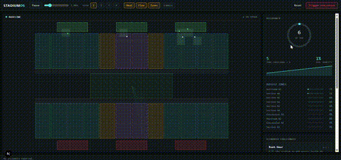

<div align="center">

# StadiumOS

**A real-time stadium crowd simulation & operations console.**

Watch up to four independent scenarios simulate 500–650 people moving through
a live stadium — entering, seating, queuing at concessions and restrooms,
and exiting — while a live metrics sidebar tracks occupancy, flow, density,
and queue length. Three scored scenario challenges turn it into something
you play, not just something you watch.

Built with Next.js 16 · TypeScript · Canvas 2D — zero external UI dependencies.

### [**Live demo →**](https://stadiumos-cmok.vercel.app/)

</div>

<br/>

<div align="center">



</div>

<br/>

---

## What this actually is

StadiumOS is a **crowd behavior simulation**, not a dashboard wired to real
stadium sensors. Every agent, every occupancy number, every alert is
generated by the simulation engine in this repo — there is no camera feed,
turnstile integration, or POS connection behind it. "Live" describes the
simulation clock (it runs continuously, agents move every frame, metrics
recompute every second) — not a real-world data source.

If you need it to reflect an actual venue, the ingestion layer is the one
piece designed to be swapped out — see [Extending with real data](#extending-with-real-data).

---

## Features

- **Independent parallel realities** — Baseline, Peak Rush, Concert, and
  Evacuation each run their own simulation with different spawn rates, agent
  speeds, and seating bias. View 1–4 side by side.
- **Real agent behavior**, not particles — a five-state machine
  (`entering → roaming → seated / queuing → roaming → exiting`) with
  load-balanced, capacity-aware destination picking, so agents don't all
  pile into the first open section.
- **Live operational metrics** — occupancy gauge, flow-rate sparkline,
  average density, per-zone queue lengths, and threshold-based bottleneck /
  zone-full alerts with cooldowns (no event spam).
- **Scenario challenges with real scoring** — Rush Hour, Halftime Surge, and
  Evacuation Drill each have a measurable objective, a live progress bar,
  and a 1–3 star result. Best scores and unlocked achievements persist
  across sessions via `localStorage`.
- **Operator controls** — play/pause, speed control, heatmap / flow trail /
  zone / label toggles, a one-click evacuation override, and full keyboard
  shortcuts.
- **60fps at scale without taxing React** — agent positions are rendered via
  an imperative Canvas draw loop (`useImperativeHandle`), completely
  bypassing React's reconciliation for the hot path. React state is reserved
  for the ~1Hz things a person actually needs to see re-render.

---

## Quickstart

**Try it live:** [stadiumos-cmok.vercel.app](https://stadiumos-cmok.vercel.app/) — no install required.

To run it locally instead:

```bash
npm install
npm run dev
```

Open **http://localhost:3000**.

```bash
npm run build       # production build
npm run start       # serve the production build
npm run typecheck   # tsc --noEmit
npm audit           # 0 vulnerabilities as of next@16.2.10 + postcss override
```

---

## Controls

| Action | Key | Also available as |
|---|---|---|
| Play / pause | `Space` | Button, top-left of control bar |
| Switch view mode (1–4 realities) | `1`–`4` | View chip buttons |
| Toggle heatmap | `H` | "Heat" chip |
| Toggle flow trails | `F` | "Flow" chip |
| Toggle zone outlines | `Z` | "Zones" chip |
| Toggle zone labels | `L` | "Labels" chip |
| Speed up / down | `+` / `-` | Speed slider |
| Reset current view(s) | `R` | "Reset" button |
| — | — | **"Trigger evacuation"** — forces every visible reality's agents to route to their nearest exit immediately |

---

## Scenario challenges

| Challenge | Objective | Time limit | 3★ threshold |
|---|---|---|---|
| **Rush Hour** | Reach 450 simultaneous guests | 90s | No bottleneck alerts, done ≤60s |
| **Halftime Surge** | Keep every concession/restroom queue ≤6 people | 60s | Zero seconds spent over threshold |
| **Evacuation Drill** | Alarm sounds at T+5s — clear the stadium to zero occupants | 75s | No bottleneck alerts, done ≤45s |

Scores and achievement unlocks are stored per-browser (`localStorage`) — see
`src/lib/storage.ts`.

---

## Architecture

```
src/
├── app/
│   ├── layout.tsx          Root layout + metadata
│   ├── page.tsx             Entry point (wraps Dashboard in ErrorBoundary)
│   └── globals.css          Design tokens, layout, component styles
├── components/
│   ├── dashboard.tsx         Owns the single shared simulation + render loop
│   ├── stadium.tsx           Canvas renderer — imperative draw(), not React state
│   ├── metrics.tsx           Occupancy gauge, flow sparkline, zone occupancy list
│   ├── controls.tsx          Top control bar + keyboard shortcut handling
│   ├── challenge-panel.tsx   Scenario objectives, live progress, scoring, achievements
│   └── error-boundary.tsx    Class-based error boundary with reset
└── lib/
    ├── types.ts               Domain model — the single source of truth for every shape
    ├── zones.ts                Programmatic stadium layout generator
    ├── agents.ts                Agent state machine (behavior layer, framework-agnostic)
    ├── simulation.ts            SimulationEngine — one instance per reality
    ├── metrics.ts                Rolling snapshot buffer + threshold event detection
    ├── realities.ts              The four reality presets (speed, spawn rate, seat bias)
    ├── challenges.ts             Challenge definitions, live evaluation, scoring
    ├── achievements.ts           Achievement unlock rules
    └── storage.ts                Typed, SSR-safe localStorage wrapper
```

### Why agent positions never touch React state

Each `SimulationEngine` mutates a plain array of `Agent` objects directly, at
up to 60 ticks/second, across up to four realities (~2,000 agents combined
in the worst case). `StadiumCanvas` exposes an imperative `draw()` method;
`Dashboard`'s single `requestAnimationFrame` loop calls `engine.tick()` then
`draw()` on every visible canvas. Re-rendering React on every frame for that
volume of mutation would be a straightforward performance mistake — so
React state is reserved for what a person actually needs to see re-render:
metrics (once per simulated second), challenge progress, and toggles.

### Why the stadium layout is generated, not hand-placed

`generateStadiumZones()` builds two mirrored 12-slot stands (8 seating + 2
concession + 2 restroom each) from a single slot-pattern array, plus a
field, two concourse corridors used for bottleneck detection, and three
entrance/exit gates. Section counts, capacities, and pixel geometry are
derived from the same source, so they can never drift out of sync with each
other the way hand-typed rectangles eventually do.

---

## Known limitations

Being upfront about what this is *not*, so nobody discovers it the hard way:

- **No collision avoidance or social-force crowd modeling** — agents steer
  directly toward targets; they don't push against or route around each
  other. It looks alive, it isn't a rigorous pedestrian-dynamics model.
- **No real data ingestion** — see [above](#what-this-actually-is).
- **No automated tests or CI** — `tsc --noEmit` and `next build` are the
  only verification currently in the loop.
- **Single-session, single-browser** — no backend, no multiplayer, no
  shared leaderboard; `localStorage` only.
- **Not accessibility-audited** — keyboard shortcuts exist, but the app
  hasn't been run through a screen reader or a real mobile device pass.

## Extending with real data

The seam to swap in a real venue is `SimulationEngine.tick()` in
`src/lib/simulation.ts`. Replace the synthetic spawn accumulator and
`stepAgent()` calls with a subscription to an actual feed — e.g. turnstile
counts driving spawn rate, a people-counting CV pipeline driving zone
occupancy directly, or a fire panel driving `triggerEvacuation()` — and keep
`MetricsEngine`, the challenge evaluators, and every component downstream
exactly as-is; they only consume the `Agent[]` / `MetricSnapshot` shapes in
`src/lib/types.ts`, not where those numbers came from.

---

## License

MIT — see [`LICENSE`](./LICENSE). In short: free to use, modify, and
distribute, including commercially, as long as the copyright notice is kept;
provided as-is with no warranty.